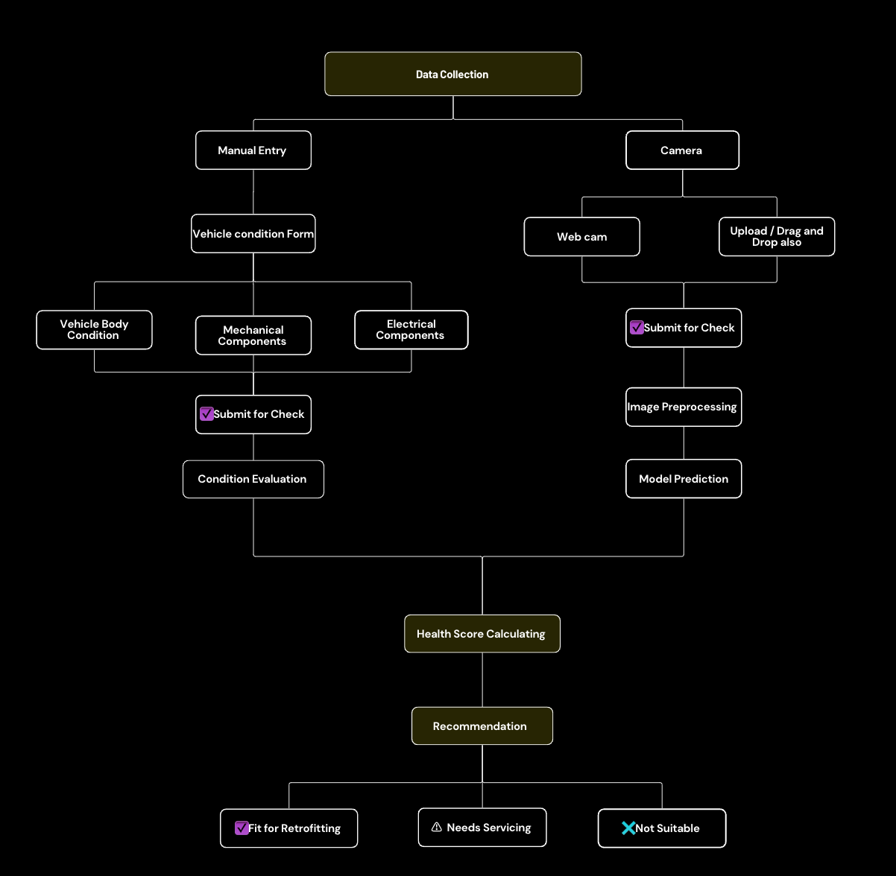

# 🚗 Vehicle Retrofitting Eligibility Web App

A full-stack web application that determines the eligibility of a vehicle for retrofitting based on either manual data entry or an image-based assessment using machine learning.

---

## 📌 Features

- 📝 Manual entry form to assess vehicle condition (body, mechanical, electrical)
- 📷 Camera upload (webcam or drag-and-drop) for photo-based vehicle assessment
- 🤖 TensorFlow.js-powered image processing and prediction
- 📊 Health score calculation and condition-based recommendation
- 📍 Nearby retrofitting workshop locator (map-integrated)
- ⚡ Responsive design with a modern React + Vite frontend

---

## 🧠 Retrofitting Process Flow

The app follows two data input paths: **Manual Entry** and **Camera-Based Assessment**. Here's how it works:

### 1. **Data Collection**

- **Manual Entry:** User fills a structured form with condition details.
- **Camera Upload:** User captures or uploads a photo of the vehicle.

### 2. **Manual Entry Path**

- Users input:
  - **Vehicle Body Condition**
  - **Mechanical Components**
  - **Electrical Components**
- After clicking **Submit for Check**, the app evaluates inputs using a condition scoring system.

### 3. **Camera-Based Path**

- Image can be captured via **Webcam** or uploaded by **Drag-and-Drop**.
- Once submitted, the image is:
  - Preprocessed for clarity and focus.
  - Sent to a **model** for prediction (via TensorFlow.js).
  
### 4. **Health Score Calculation**

- Both paths lead to a central health score computation.
- Normalized score reflects overall vehicle condition.

### 5. **Recommendation Outcome**

- ✅ **Fit for Retrofitting**
- ⚠️ **Needs Servicing**
- ❌ **Not Suitable**

---

## 🛠️ Tech Stack

- **Frontend:** React.js, Vite, Tailwind CSS
- **Backend:** Node.js, Express.js
- **Machine Learning:** TensorFlow.js (Client-side prediction)
- **Other Tools:** Git, VS Code, Vercel

---

## 🧪 How to Run Locally

### 1. Clone the Repository

```bash
git clone https://github.com/Mohitjain9654/vehicle-retrofit-app.git
cd vehicle-retrofit-app
```

### 2. Setup Backend
```
cd Server
npm install
nodemon app.js
```
### 3. Setup Frontend
```
cd Client
npm install
npm run dev
```
---
Ensure your .env files for both frontend and backend are properly configured.

---

## 🔁 Retrofitting Process Flow

The following diagram illustrates the complete workflow followed by the app for both manual and image-based vehicle assessment:



---
## 📍 Nearby Workshops Feature

- Uses **Geolocation API** to fetch user's location
- Displays nearby **retrofitting workshops**
- Workshop info

---

## 🙋‍♂️ Author

**Mohit Jain**  
Second-year B.Tech CSE student | Passionate Web Developer  
GitHub: [@Mohitjain9654](https://github.com/Mohitjain9654)
